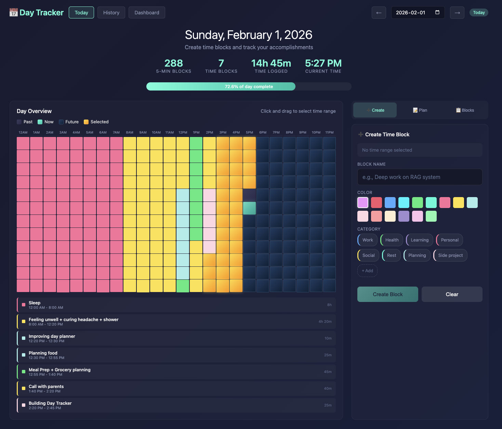
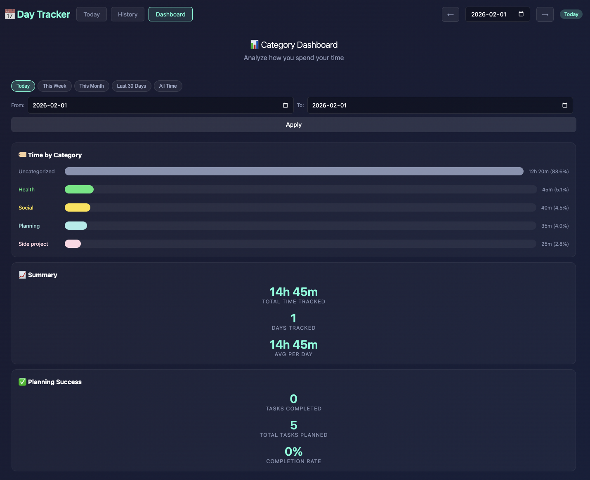
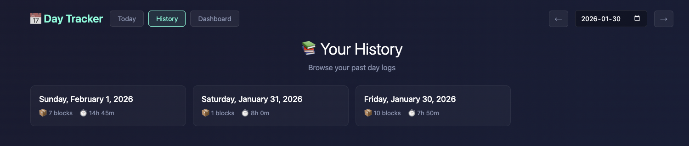
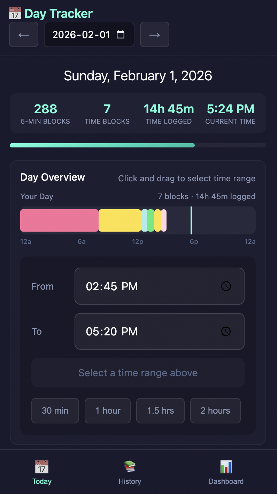
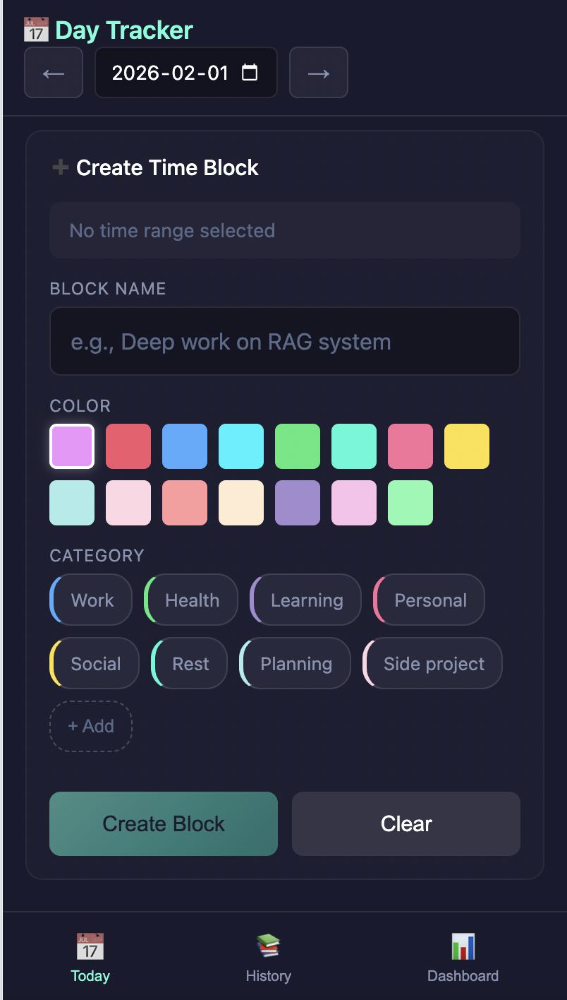

# Day Tracker

I built this because I wanted a simple way to see where my time actually goes. Most time tracking apps are either too complicated or require you to remember to start/stop timers. This one works differently — you fill in blocks at the end of a session or day, kind of like a visual journal.



## What it does

Your day is shown as a grid of 5-minute blocks (288 total). You drag to select a time range, name it, pick a category, and that's it. The color is automatic based on the category.

There's also:
- A daily planning section where you can jot down what you want to get done
- A dashboard that shows where your time went over any date range
- History view to browse past days — useful for weekly reviews or seeing what you were up to last Tuesday





## Mobile

I use this from my phone constantly, so the mobile experience had to be good.

<p>
  
  &nbsp;&nbsp;
  
</p>

The desktop grid doesn't work well on a small screen, so mobile gets a different UI:
- **Visual timeline bar** — your whole day shown as a compact horizontal bar with colored blocks
- **Time picker** — tap From/To inputs to select times with the native picker (way easier than tiny grid blocks)
- **Quick duration buttons** — one tap to set "30 min", "1 hour", etc. starting from now
- **Bottom navigation** — thumb-friendly access to Today, History, and Dashboard
- **Swipe navigation** — swipe on the header to jump between days

Tap any block on the timeline to select it and see its details.

## Running it

```bash
npm install
npm start
```

Goes to `localhost:3000`. If you want to access it from your phone, the server prints your local network IP on startup.

## Deploying

I have this running on Render with a Turso database so I can access it anywhere. The free tier works fine.

Set these env vars:
- `TURSO_DATABASE_URL` 
- `TURSO_AUTH_TOKEN`

Without those, it just saves to JSON files locally (which is fine for dev).

## Structure

```
server.js        - API routes
public/
  index.html     - the whole frontend is here
data/            - JSON files for each day (local dev only)
```

The frontend is a single HTML file. No build step, no framework. It's refreshingly simple to work with.

## License

MIT

